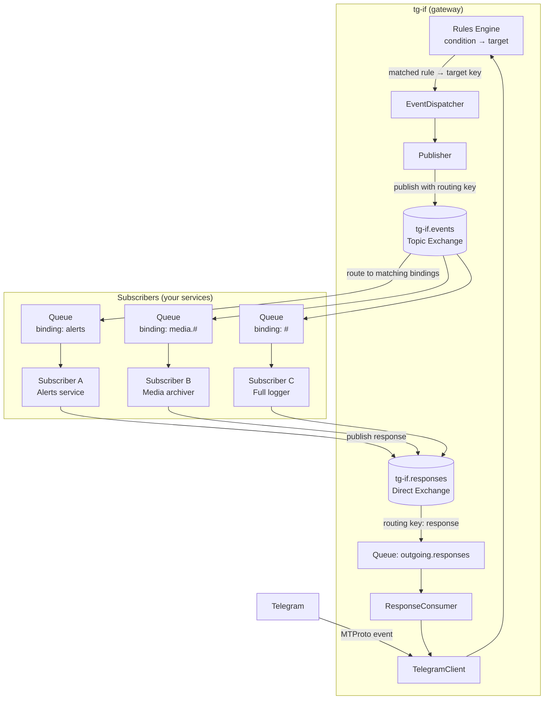

# Architecture Overview

## System Purpose

tg-if is a Telegram MTProto gateway service that receives events via Pyrofork, routes them through a rules engine, and publishes to RabbitMQ (AMQP) for subscriber consumption. Also consumes responses from `outgoing.responses` and sends them to Telegram.

## Flow

```text
Telegram → Pyrofork → EventDispatcher → Publisher → RabbitMQ (tg-if.events)
                                                                           ↓
                                                               Subscriber Services
                                                                           ↓
                                                               outgoing.responses
                                                                           ↓
RabbitMQ (tg-if.responses) → Consumer → ResponseConsumer → TelegramClient → Telegram

Subscriber → GET /files/{bot_id}/{file_id} → tg-if (HTTP proxy) → Telegram (on demand)
```

Media files flow through a separate HTTP path: see `doc/media_retrieval.md` for full design.

## Layers

### Domain Layer (`src/domain/`)

- Entities: TelegramEvent, RoutingContext, OutgoingResponse, enums (EventType, ChatType)
- Rules: RoutingRule, RulesEngine with condition matching

### Application Layer (`src/app/`)

- EventDispatcher: routes events through RulesEngine and publishes
- ResponseConsumer: handles outgoing responses
- ReceiverService: orchestrator wiring all components
- AdminNotifier: sends control-plane alerts via admin bot
- AdminCommandHandler: interactive admin bot commands
- ServiceMetrics: per-bot event and response counters
- LogBuffer: in-memory ring buffer for structlog

### Infrastructure Layer (`src/infrastructure/`)

- config.py: AppConfig via env vars + bots.json
- telegram/client.py: Pyrofork client wrapper (6 send methods)
- telegram/handlers.py: event conversion from MTProto to domain entities
- broker/rabbitmq.py: RabbitMQManager (topology: tg-if.events topic + tg-if.responses direct)
- broker/publisher.py: publish to tg-if.events
- broker/consumer.py: consume with transparent retry
- health.py: aiohttp health server (port 8080) — also hosts GET /files/{bot_id}/{file_id} for media retrieval
- metrics_exporter.py: Prometheus /metrics endpoint
- media/ (future): disk cache store, HTTP proxy endpoint, eager download background task, media config consumer (`tg-if.media-config`)
  - Full design: `doc/media_retrieval.md`

### AMQP Topology



**Routing rules ≠ queues.** Rules produce routing keys (targets). Subscribers create their own queues and bind them with patterns to `tg-if.events` — tg-if never creates subscriber queues.

- **tg-if.events** (topic, durable): incoming events published with rule target as routing key
- **tg-if.responses** (direct, durable): outgoing.responses (subscriber replies), media-config (media download policy), subscriber-commands (bot command registration)

## Key Decisions

- Pyrofork (MTProto) over HTTP Bot API
- Regular RabbitMQ AMQP (not Streams)
- Internal retry over NACK requeue
- Admin bot with dedicated session
- Prometheus metrics via /metrics endpoint
- Hybrid eager/lazy media retrieval (see `doc/media_retrieval.md`)
